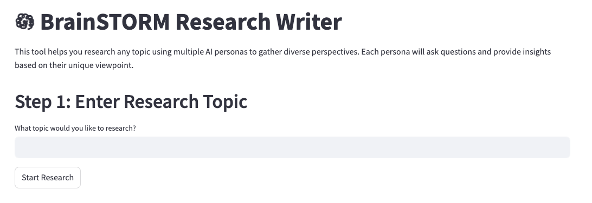

# 𖡎 BrainSTORM Research Writer



BrainSTORM is an AI-powered research assistant that leverages multiple AI personas to provide comprehensive, multi-perspective research on any topic. Using advanced language models and a multi-agent system, it generates well-rounded, thoroughly researched articles by simulating diverse viewpoints and expertise.

## 🏛️ Inspired By STORM

BrainSTORM is inspired by **STORM**, a research project by Stanford OVAL Lab. STORM is an LLM-based system that writes Wikipedia-style articles from scratch using real-time Internet search. BrainSTORM expands on this idea with enhanced multi-agent collaboration.

## 🌟 Key Features

- **Multi-Persona Research System**

  - Dynamically generates diverse research personas
  - Each persona brings unique expertise and perspective
  - Facilitates rich, multi-dimensional topic exploration

- **Interactive Research Process**

  - Real-time conversation visualization
  - Progress tracking with dynamic updates
  - Source citation and reference management
  - Automatic fact-checking and verification

- **Advanced Article Generation**
  - Structured outline creation
  - Section-by-section drafting
  - Automatic citation formatting
  - Coherent narrative integration

## 🚀 Getting Started

### Prerequisites

- Python 3.12 or higher
- OpenAI API key (for GPT-4 access)
- Tavily API key (for research capabilities)

### Installation

1. Clone the repository:

```bash
git clone https://github.com/yourusername/pydantic-research-agent.git
cd pydantic-research-agent
```

2. Install dependencies using uv (recommended):

```bash
# Install uv if you haven't already
curl -LsSf https://astral.sh/uv/install.sh | sh

# Create virtual environment and install dependencies
uv venv
uv pip install -r requirements.lock
```

3. Set up environment variables:

```bash
cp .env.example .env
# Add your API keys to .env:
# OPENAI_API_KEY=your-key-here
# TAVILY_API_KEY=your-key-here
```

### Running the Application

Launch the Streamlit interface:

```bash
streamlit run app.py
```

## 🏗️ Project Structure

```
pydantic-research-agent/
├── src/
│   ├── agents/                 # AI agent implementations
│   │   ├── agent_persona_gen.py    # Persona generation
│   │   ├── agent_outline_gen.py    # Outline creation
│   │   └── agent_article_gen.py    # Article generation
│   ├── core/                   # Core functionality
│   │   ├── config.py              # Configuration settings
│   │   ├── prompts/              # System prompts
│   │   └── pydantic_models.py    # Data models
│   ├── tools/                  # External integrations
│   │   └── search_tools.py       # Search capabilities
│   └── utils/                  # Helper functions
├── app.py                     # Streamlit web interface
└── research_agent.py          # Main agent orchestration
```

## 🔧 Configuration

### Environment Variables

Required in `.env`:

- `OPENAI_API_KEY`: Your OpenAI API key
- `TAVILY_API_KEY`: Your Tavily API key

### Configurable Parameters

In `src/core/config.py`:

- `NUM_PERSONAS`: Number of research personas (default: 3)
- `CONVERSATION_LOOP`: Conversation rounds per persona (default: 2)
- `MAX_CHAR_LIMIT`: Section character limit (default: 2000)
- `MAX_SEARCH_RESULT`: Search results per query (default: 3)

## 💡 Usage Example

1. Launch the application
2. Enter your research topic
3. Watch as multiple AI personas:
   - Generate relevant subtopics
   - Create a structured outline
   - Engage in research conversations
   - Draft comprehensive sections
4. Review and download the final article

## 🤝 Contributing

Contributions are welcome! Please:

1. Fork the repository
2. Create a feature branch
3. Commit your changes
4. Push to the branch
5. Submit a pull request

## 🙏 Acknowledgments

- Stanford OVAL lab
- Tavily for research capabilities
- Pydantic AI for agentic framework

## 📧 Contact

For questions, feedback, or issues:

- Open a GitHub issue
- Submit a pull request
- Contact the maintainers
